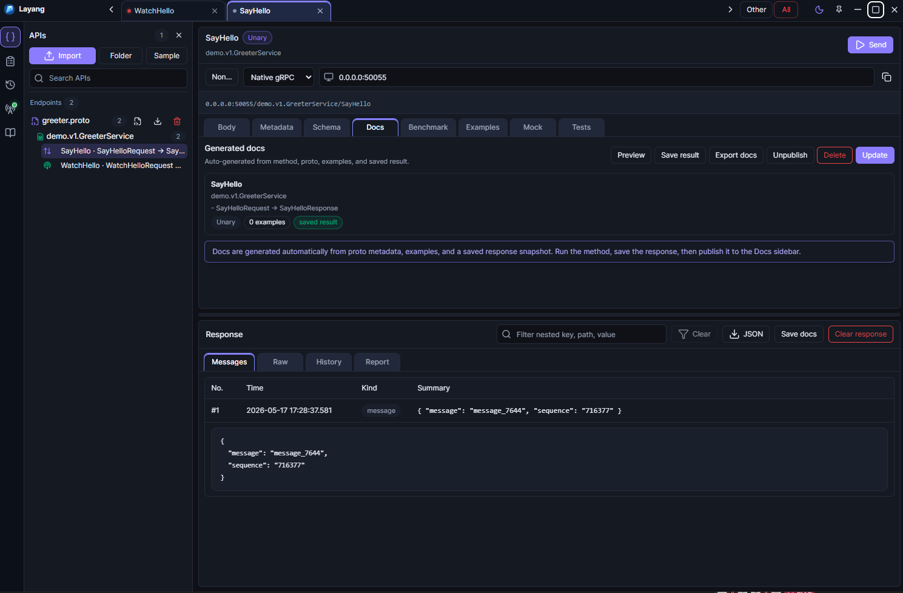
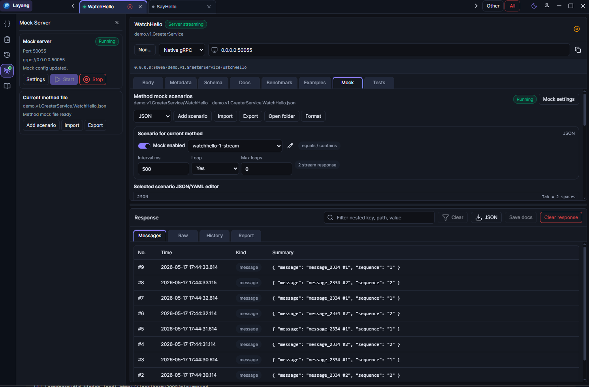
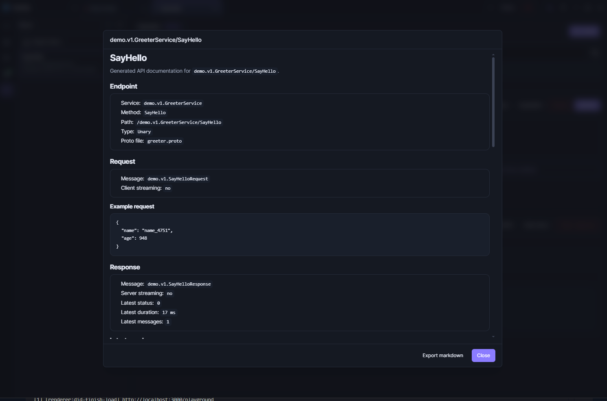

<p align="center">
  
</p>

# Layang

[](https://layang.mff.web.id/)
[](https://github.com/flik-lab/layang/releases)
[](./LICENSE)

Layang is a workspace-based API workbench for testing, mocking, benchmarking, documenting, and automating APIs across gRPC, gRPC-Web, WebSocket, and REST.

Layang `1.0.3` fixes the first-message delivery issue in gRPC-Web server streams and improves the Windows desktop setup with Squirrel installer shortcuts, single-instance behavior, and GitHub Releases based auto-update support.



## Download

- Website: [layang.mff.web.id](https://layang.mff.web.id/)
- Windows and release files: [GitHub Releases](https://github.com/flik-lab/layang/releases)
- Source code: [github.com/flik-lab/layang](https://github.com/flik-lab/layang)

## What Layang Does

- Test gRPC, gRPC-Web, WebSocket, and REST APIs in one desktop workspace.
- Save requests, examples, docs, environments, mocks, and history as readable files.
- Run local mock servers for gRPC, WebSocket, and REST workflows.
- Generate Markdown or HTML docs from proto files, saved examples, mocks, and responses.
- Run CLI checks for CI/CD against the same workspace used in the desktop app.

## Features

- Import `.proto` files and browse services, methods, request types, and response types.
- Run unary and server-streaming calls over gRPC-Web or native gRPC.
- Save request tabs, metadata, environments, examples, tests, response history, and docs metadata in a workspace folder.
- Edit per-method mock scenarios and run a local mock server from the desktop app.
- Tune streaming mock interval, loop mode, max loops, and response sequences.
- Run latency benchmarks and export benchmark JSON reports.
- Generate Markdown or HTML API docs from proto files, saved examples, mocks, and latest responses.
- Use the CLI in CI to validate workspaces, list saved requests, check mock scenarios, and run native gRPC requests.
- Use the WebSocket workbench for live connections, message sending, local mock responses, benchmark exports, and generated docs.
- Use the REST workbench for params, headers, auth, bodies, docs, examples, local mocks, scenario matching, and templates.

## Release 1.0.3

The `1.0.3` release fixes gRPC-Web server-streaming delivery so the first streamed response appears immediately instead of waiting until the listener is stopped. It also improves the Windows desktop setup with Squirrel installer shortcuts, single-instance behavior, and GitHub Releases based auto-update support.

## Release 1.0.2

The `1.0.2` release focuses on stability and maintainability. It keeps REST, WebSocket, gRPC, and gRPC-Web in one workspace while improving gRPC mock scenario persistence, manifest-based scenario file loading, runtime freshness checks, logging, packaging commands, and test coverage.

## Install

For most users, the simplest path is:

1. Download `LayangSetup.exe` from [GitHub Releases](https://github.com/flik-lab/layang/releases).
2. Run the installer.
3. Open Layang from the Start Menu or Desktop shortcut.
4. On first launch, choose the workspace folder location you want to use.

Windows packaging and auto-update details are documented in [WINDOWS_SETUP.md](./WINDOWS_SETUP.md).

## Mocking And Streaming



Mock scenarios live with the workspace and can be edited as JSON/YAML. Server-streaming methods can use repeated responses with interval and loop controls.

## Documentation



Generated docs can include proto metadata, saved examples, mock scenarios, and the latest saved responses. Export them as Markdown or HTML for static publishing.

## CLI

```powershell
pnpm run cli -- --help
pnpm run cli -- validate ./workspace --json
pnpm run cli -- list ./workspace
pnpm run cli -- run ./workspace --env dev --reporter junit --output reports/layang-junit.xml
pnpm run cli -- mock:check ./workspace
```

When the package is linked or installed, the command is exposed as `layang`.

## Workspace

The desktop app can create or open a workspace folder. A workspace stores a snapshot plus Git-friendly files under folders such as `protos/`, `requests/`, `examples/`, `docs/`, `environments/`, `history/`, and `mocks/`.

The default desktop workspace is:

```text
Documents/Layang/Workspace
```

You can also choose a custom workspace folder on first launch in the desktop app.

## For Contributors

Development setup, local build commands, and packaging notes are in [CONTRIBUTING.md](./CONTRIBUTING.md).

## License

MIT

## Mock Guides

- [gRPC mock scenarios](guide-scenario-mock-grpc.md)
- [REST mock scenarios](guide-scenario-mock-rest.md)
- [WebSocket mock scenarios](guide-scenario-mock-websocket.md)
