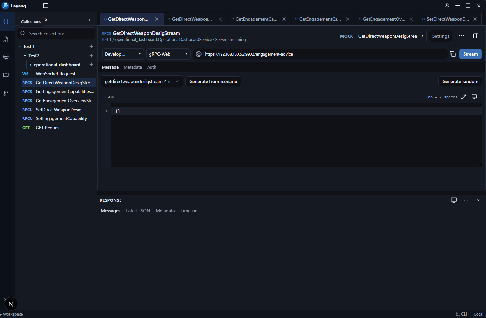
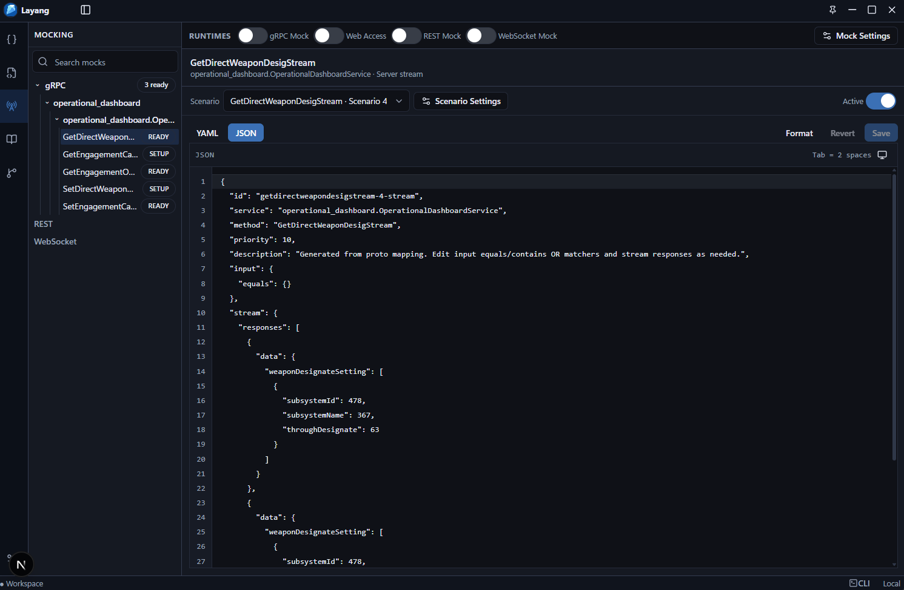
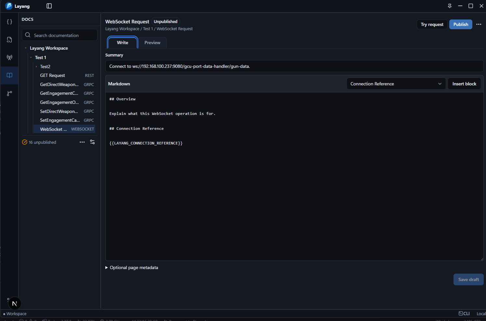

<p align="center">
  
</p>

# Layang

[](https://layang.mff.web.id/)
[](https://github.com/flik-lab/layang/releases)
[](./LICENSE)

Layang is a workspace-based API workbench for testing, mocking, benchmarking, documenting, and automating APIs across REST, WebSocket, gRPC, and gRPC-Web.

The current workbench refactor focuses on a clearer request-first workflow: a permanent icon rail with a contextual sidebar, protocol-aware request and response panels, a dedicated gRPC Mock workspace, simplified Web Access, and a compact Schemas workspace.



## Download

- Website: [layang.mff.web.id](https://layang.mff.web.id/)
- Windows and release files: [GitHub Releases](https://github.com/flik-lab/layang/releases)
- Source code: [github.com/flik-lab/layang](https://github.com/flik-lab/layang)

## Workbench UX

The desktop UI uses a permanent icon rail for **Requests**, **Schemas**, **Services**, **Docs**, and **Settings**, plus a contextual panel for the selected area. Services contains **gRPC**, REST Mock, and WebSocket Mock. The gRPC workspace includes Methods, Proto, Web access, and Activity in one place. Request-specific examples and documentation remain inside each request.

## What Layang Does

- Test REST, WebSocket, gRPC, and gRPC-Web APIs in one desktop workspace.
- Save requests, examples, docs, environments, mocks, and service profiles as readable files.
- Run local mock servers for gRPC, WebSocket, and REST workflows.
- Reload mock scenario files manually when they are edited outside Layang.
- Trust internal HTTPS/APISIX certificates through imported `.pem`, `.crt`, or `.cer` files.
- Generate Markdown or HTML docs from proto files, saved examples, mocks, and responses.
- Run CLI checks for CI/CD against the same workspace used in the desktop app.

## Features

- Import `.proto` files and browse services, methods, request types, and response types.
- Run unary and server-streaming calls over gRPC-Web or native gRPC.
- Save request tabs, metadata, environments, examples, tests, and docs metadata in a workspace folder.
- Edit per-method mock scenarios and run a local mock server from the desktop app.
- Use **Update from file** to pull external edits from `mocks/grpc/server.yml` and `mocks/grpc/methods/**` into the editor and running mock server.
- Tune streaming mock interval, loop mode, max loops, and response sequences.
- Import multiple trusted HTTPS certificates and review them by file name, source path, and SHA-256 fingerprint.
- Use `Ctrl++`, `Ctrl+-`, and `Ctrl+0` to resize the desktop UI.
- Run latency benchmarks and export benchmark JSON reports.
- Generate Markdown or HTML API docs from proto files, saved examples, mocks, and latest responses.
- Use the CLI in CI to validate workspaces, list saved requests, check mock scenarios, and run native gRPC requests.
- Use the WebSocket workbench for live connections, message sending, local mock responses, benchmark exports, and generated docs.
- Use the REST workbench for params, headers, auth, bodies, docs, examples, local mocks, scenario matching, and templates.

## Release 1.1.3

The `1.1.3` release focuses on smoother editing, predictable runtime controls, and configurable gRPC timeouts.

Highlights:

- Responsive buffered editors for request bodies and mock scenarios.
- Per-request unary and stream-idle timeouts across native gRPC and gRPC-Web, including unlimited streams.
- Locked runtime switchers with compact in-switch loading indicators.
- A consistently docked contextual sidebar at every zoom level.

## Release 1.1.0

The `1.1.0` release is a major workflow and platform update across workspaces, schemas, mocks, documentation, and browser access.

Highlights:

- Git-friendly Workspace Format v6 with split YAML files, immutable proto snapshots, migration, and validation.
- Clearer Collections, Proto Schemas, request tabs, and grouped gRPC Mock scenario workflows.
- Unified Markdown documentation with generated references, static-site and wiki exports, and CLI build checks.
- Embedded gRPC Gateway and browser gRPC-Web access with streaming, TLS/mTLS, and traffic controls.
- Cross-platform HTTPS certificate setup and a normalized, accessible design system.

## Install

For most users, the simplest path is:

1. Download `LayangSetup.exe` from [GitHub Releases](https://github.com/flik-lab/layang/releases).
2. Run the installer.
3. Open Layang from the Start Menu or Desktop shortcut.
4. On first launch, choose the workspace folder location you want to use.

Windows packaging and auto-update details are documented in [WINDOWS_SETUP.md](./WINDOWS_SETUP.md).

## Mocking And Streaming



gRPC mock scenarios live with the workspace and use YAML as the canonical editor and file format. Existing JSON/YAML files can still be imported. Server-streaming methods can use repeated responses with interval and loop controls. When a scenario file is edited in another editor, click **Update from file** in Layang to refresh the UI and running mock server.

## Certificate Settings

Certificate settings are available from **Settings → Network**. Import one or more `.pem`, `.crt`, or `.cer` files to trust internal HTTPS, APISIX, gRPC-Web, or native gRPC lab targets. Layang shows the imported certificate list and SHA-256 fingerprints; the raw PEM editor is intentionally not shown in the UI.

For local/self-signed development endpoints, **Bypass TLS errors** remains an explicit opt-in escape hatch. It accepts certificate validation failures but does not convert plain HTTP into HTTPS or repair a TLS server that sends no certificate.

## Documentation



Layang provides unified REST, WebSocket, and pinned-gRPC documentation:

- Edit Git-friendly Markdown and front matter at workspace, collection, folder, and request level.
- Generate workspace/folder operation indexes plus complete endpoint, request, response, schema, error, example, mock, related-operation, and source sections.
- Preview reader-facing pages with an outline, validation diagnostics, and normal request-editor handoff for testing.
- Generate redacted Layang CLI, cURL/grpcurl/wscat, JavaScript, and Python samples.
- Publish one complete Markdown page per API operation and a responsive static portal with full-text search, protocol filters, anchors, breadcrumbs, code copy, and previous/next navigation.
- Generate `docs/wiki-export/` with clean linked Markdown, `README.md`, and `SUMMARY.md` for Outline, GitBook, Docusaurus, MkDocs, or another wiki.
- Expand nested JSON/proto fields, `oneof` members, RPC comments, WebSocket events/close codes, examples, and mock request/response payloads into readable reference sections.
- Exclude disabled parameters, headers, examples, and mocks while redacting secrets from documentation and code samples.
- Detect stale generated pages, unresolved proto references, missing response/error coverage, and broken local links.

```powershell
layang docs:build ./workspace
layang docs:check ./workspace
layang docs:build ./workspace --check
```

After `docs:build`, import the `docs/wiki-export/` directory into a wiki or use `SUMMARY.md` to preserve the workspace → collection → folder → operation hierarchy.

## Web Access and legacy gateway CLI

The desktop UX exposes **Web access** inside the gRPC workspace. A persistent **Run mode** selector switches between Native gRPC and Web access while keeping status and Start/Stop controls in the same toolbar position on every gRPC tab. Advanced browser endpoint, TLS, CORS, target, and log settings remain in the Web access tab.

Legacy gateway profiles and CLI commands remain readable for compatibility and advanced headless workflows, but Gateway/Hybrid/Proxy modes are no longer presented as the primary desktop UX. Browser gRPC-Web supports unary and server streaming, while native clients keep client-streaming and bidirectional support.

```bash
layang gateway:list ./workspace
layang gateway:start ./workspace --profile "Track Gateway" --daemon
layang gateway:status ./workspace --profile "Track Gateway"
```

Web Access supports HTTP, Local HTTPS, custom PEM, and PFX/P12 certificates. The Local HTTPS wizard detects Windows or Linux, includes the configured listener host in SAN, offers Current User or UAC-approved All Users trust on Windows, uses the available system/NSS trust adapter on Linux, validates the certificate, and keeps machine-local certificate paths and PFX passphrases outside the workspace.

## CLI

The CLI uses the same Git-friendly workspace data as the UI. Headless workflows cover request execution, variables/auth, assertions, examples, mocks, proto revisions and line diffs, documentation/wiki export, benchmarks, normalized results, and gateway profiles.

```powershell
pnpm run cli -- parity ./workspace
pnpm run cli -- validate ./workspace --json
pnpm run cli -- run ./workspace --request "Get Track" --var token=... --strict-variables --strict-mock
pnpm run cli -- example:run ./workspace --example "Track found" --reporter junit --output reports/examples.xml
pnpm run cli -- example:create ./workspace --request "Get Track" --name "Friendly track"
pnpm run cli -- schema:diff ./workspace --schema "Track API" --file ./proto-next
pnpm run cli -- mock:start ./workspace --protocol all --daemon
pnpm run cli -- benchmark ./workspace --request "Get Track" --iterations 50 --threshold-p95 250
pnpm run cli -- docs:build ./workspace
```

Native gRPC supports unary, server-streaming, client-streaming, and bidirectional methods. gRPC-Web supports unary and server-streaming, matching browser protocol limits. Visual dialogs remain in the UI; the equivalent CLI workflows use readable text, JSON, JUnit, and unified line-diff output.

When the package is linked or installed, the command is exposed as `layang`.

Windows and Linux releases also publish standalone CLI packages with a private Node.js runtime, so Electron and a system Node installation are not required for CLI-only use. The same workspace can be opened later in the optional desktop app with `layang ui <workspace>`. See [CLI_STANDALONE.md](CLI_STANDALONE.md).

## Workspace

The desktop app can create or open a workspace folder. A workspace stores a snapshot plus Git-friendly files under folders such as `protos/`, `requests/`, `examples/`, `docs/`, `environments/`, and `mocks/`. Legacy history data remains readable for migration but is no longer presented as a primary UI workflow.

Machine-local settings such as imported certificates, TLS bypass, logger settings, and zoom level are stored under Electron `userData`, not inside the workspace.

The default desktop workspace is:

```text
Documents/Layang/Workspace
```

You can also choose a custom workspace folder on first launch in the desktop app.

## For Contributors

Development setup, local build commands, and packaging notes are in [CONTRIBUTING.md](./CONTRIBUTING.md).

## Mock Guides

- [gRPC mock scenarios](guide-scenario-mock-grpc.md)
- [REST mock scenarios](guide-scenario-mock-rest.md)
- [WebSocket mock scenarios](guide-scenario-mock-websocket.md)

## License

MIT

## Git-friendly workspace v6

Layang workspace folders use a human-readable filesystem as the canonical source of truth:

```text
workspace/
├── layang.yml
├── collections/        # one native YAML file per request; examples live beside requests
├── protos/             # immutable full-snapshot revisions containing raw .proto files
├── environments/       # shared targets and non-secret variables
├── mocks/              # native YAML gRPC/REST/WebSocket scenarios
├── workspace-schemas/  # JSON Schema for external editors and CI
├── docs/
└── .layang/            # ignored local tabs, paths, last-used environments, cache, results
```

Desktop and CLI read the same files. Request bodies, assertions, examples, and mock payloads are native YAML values rather than JSON strings inside YAML. Proto revisions are self-contained snapshots and are checksum-verified on load. Absolute local paths and per-user environment selections stay in `.layang/local.yml`.

Workspace v5 and legacy v4 folders remain readable. Use `layang workspace:migrate . --check` to inspect migration and `layang workspace:migrate .` to create v6 files with a local backup. See [Workspace Format v6](./docs/architecture/workspace-format.md).

## Git-native Source Control MVP

The desktop rail now includes a **Source Control** workspace backed by the native Git executable. It supports repository initialization, clone, entity-aware status and source diff, stage/unstage, guarded discard, pre-commit checks, commit history, branch create/switch, remote setup, fetch, fast-forward pull, push, conflict detection, and merge continue/abort. Pending editor changes are saved before Git operations, while save, stage, commit, and push remain separate user actions.

The same workflow is available headlessly:

```bash
layang git:init ./workspace --branch main
layang git:status ./workspace --json
layang git:stage ./workspace
layang git:check ./workspace
layang git:commit ./workspace --message "feat(grpc): add Watch Track"
layang git:remote-add ./workspace --url git@gitea.company.id:team/track-api.git
layang git:push ./workspace --set-upstream
```

See [`docs/architecture/workspace-format.md`](docs/architecture/workspace-format.md) for the complete format.
